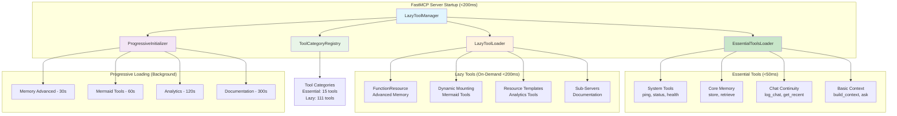
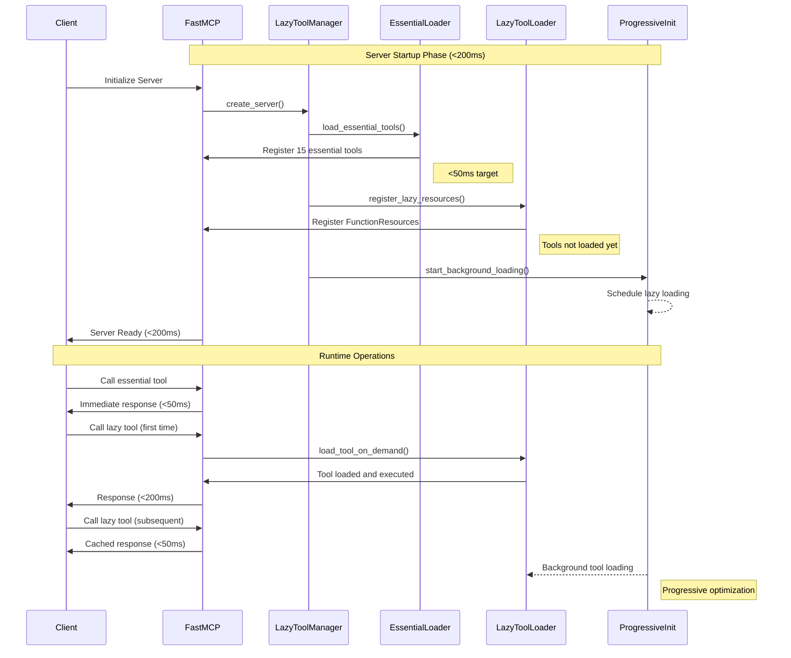
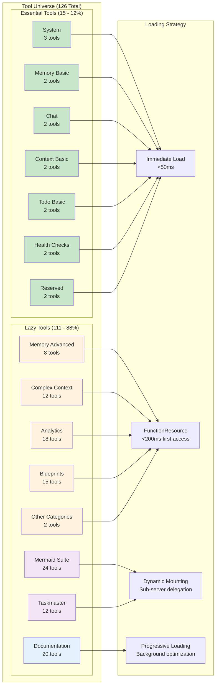
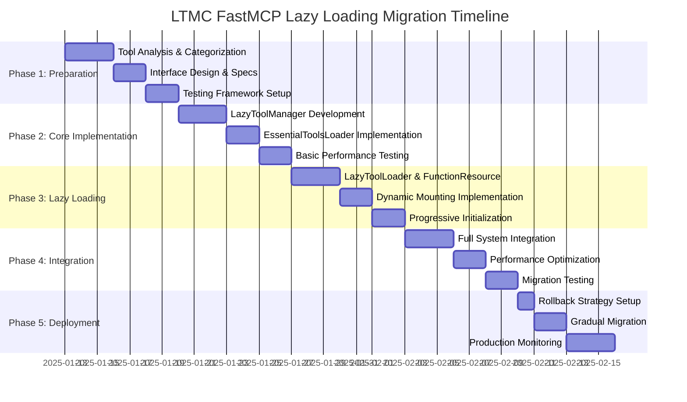
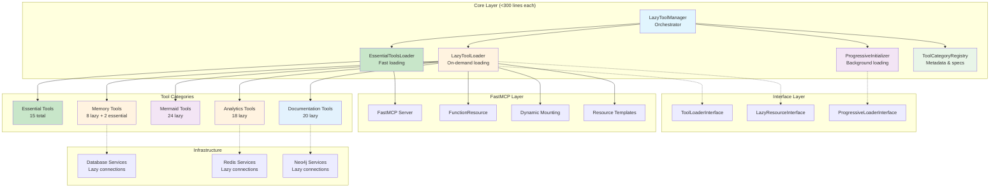

# LTMC FastMCP Lazy Loading Architecture Diagrams

## System Architecture Overview



## Component Interaction Flow



## Tool Categorization Architecture



## FastMCP Lazy Loading Pattern Implementation

```mermaid
graph TB
    subgraph "FastMCP Native Patterns"
        subgraph "FunctionResource Pattern"
            FR1[Tool Definition<br/>@mcp.resource]
            FR2[Lazy Function<br/>Only loads on URI access]
            FR3[Performance<br/>True lazy evaluation]
            FR1 --> FR2 --> FR3
        end
        
        subgraph "Dynamic Mounting Pattern"
            DM1[Sub-Server Creation<br/>Category-specific FastMCP]
            DM2[Runtime Mounting<br/>main_mcp.mount(sub, prefix)]
            DM3[Live Delegation<br/>Real-time request forwarding]
            DM1 --> DM2 --> DM3
        end
        
        subgraph "Resource Templates Pattern"
            RT1[URI Templates<br/>'tools://{category}/{tool}']
            RT2[Parameter Extraction<br/>Dynamic tool routing]
            RT3[On-Demand Loading<br/>Category-aware initialization]
            RT1 --> RT2 --> RT3
        end
        
        subgraph "Progressive Initialization"
            PI1[Background Tasks<br/>asyncio.create_task]
            PI2[Smart Scheduling<br/>Usage-based priorities]
            PI3[Predictive Loading<br/>Pattern recognition]
            PI1 --> PI2 --> PI3
        end
    end
    
    subgraph "Performance Targets"
        PT1[Startup: <200ms]
        PT2[Essential: <50ms]
        PT3[Lazy Access: <200ms]
        PT4[Memory: <100MB]
    end
    
    FR3 --> PT3
    DM3 --> PT3
    RT3 --> PT3
    PI3 --> PT1
    
    style FR1 fill:#e1f5fe
    style DM1 fill:#f3e5f5
    style RT1 fill:#fff3e0
    style PI1 fill:#e8f5e8
    style PT1 fill:#ffebee
    style PT2 fill:#ffebee
    style PT3 fill:#ffebee
    style PT4 fill:#ffebee
```

## Migration Strategy Timeline



## Component Dependency Architecture



## Performance Optimization Flow

```mermaid
graph LR
    subgraph "Startup Optimization (<200ms)"
        SO1[Minimal Imports<br/>Essential only]
        SO2[Lazy DB Connections<br/>On-demand pools]
        SO3[Registry Pre-load<br/>Metadata only]
        SO4[FastMCP Native<br/>No wrapper overhead]
        SO1 --> SO2 --> SO3 --> SO4
    end
    
    subgraph "Runtime Optimization"
        RO1[Connection Pooling<br/>Efficient reuse]
        RO2[Tool Caching<br/>Loaded tools cached]
        RO3[Predictive Loading<br/>Usage pattern analysis]
        RO4[Memory Management<br/>Selective cleanup]
        RO1 --> RO2 --> RO3 --> RO4
    end
    
    subgraph "Progressive Optimization"
        PO1[Background Loading<br/>Non-blocking preload]
        PO2[Priority Scheduling<br/>Usage-based order]
        PO3[Smart Batching<br/>Related tools together]
        PO4[Resource Monitoring<br/>Adaptive strategies]
        PO1 --> PO2 --> PO3 --> PO4
    end
    
    SO4 --> RO1
    RO4 --> PO1
    PO4 --> RO3
    
    style SO1 fill:#e8f5e8
    style RO1 fill:#fff3e0
    style PO1 fill:#f3e5f5
```



---

**Diagram Status**: ✅ Complete - Visual architecture representation ready  
**Next Phase**: Implementation of modular components based on architectural design