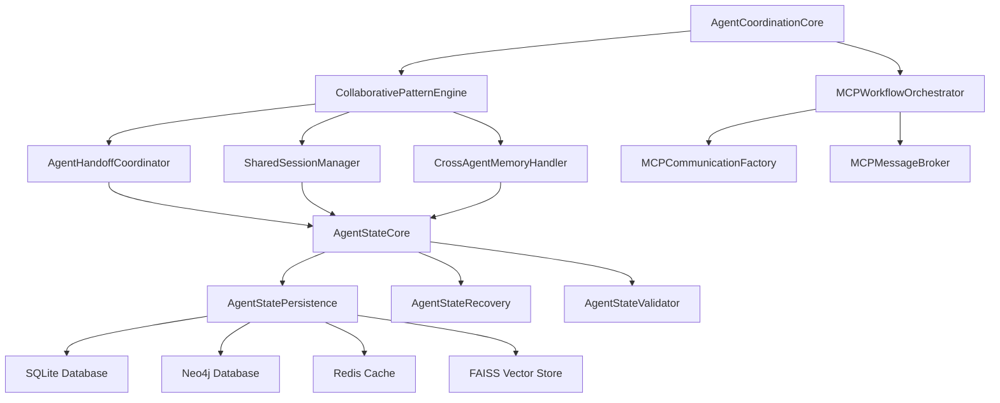

# LTMC Agent Coordination Architecture

## System Overview

LTMC implements a sophisticated multi-agent coordination system that orchestrates complex workflows with real database integration, state management, and comprehensive audit capabilities. This architecture represents enterprise-grade agent coordination far beyond basic parallel execution.

## Architecture Layers

### 1. Orchestration Layer
**Primary Components:**
- `AgentCoordinationCore` - Central orchestrator
- `CollaborativePatternEngine` - Master workflow engine
- `MCP WorkflowOrchestrator` - MCP protocol integration

**Responsibilities:**
- Task decomposition and agent assignment
- Workflow pattern execution
- Resource allocation and optimization
- Performance monitoring and metrics

### 2. Coordination Layer  
**Primary Components:**
- `AgentHandoffCoordinator` - Agent-to-agent transitions
- `SharedSessionManager` - Session lifecycle management
- `CrossAgentMemoryHandler` - Memory sharing and synchronization

**Responsibilities:**
- Agent state transitions
- Context preservation and sharing
- Session boundary management
- Inter-agent communication

### 3. State Management Layer
**Primary Components:**
- `AgentStateCore` - Core state operations
- `AgentStatePersistence` - State storage and retrieval
- `AgentStateRecovery` - Failure recovery mechanisms
- `AgentStateValidator` - State consistency validation

**Responsibilities:**
- Persistent state management across workflows
- Recovery from interrupted operations
- State validation and consistency checks
- Audit trail for all state changes

### 4. Integration Layer
**Primary Components:**
- `MCPCommunicationFactory` - MCP protocol handling
- `MCPMessageBroker` - Message routing and delivery
- `LTMCToolsIntegration` - Real tool integration

**Responsibilities:**
- MCP protocol compliance
- Tool integration and execution
- Database operations coordination
- External system interfaces

## Component Interaction Flow



## Database Integration Architecture

### Multi-Database Coordination
LTMC's agent coordination system integrates with all 4 database systems:

#### SQLite Integration
- **State persistence** for agent coordination workflows
- **Session management** data storage
- **Audit trail** and compliance logging
- **Configuration** and metadata storage

#### Neo4j Integration  
- **Agent relationship** mapping and traversal
- **Workflow dependency** graph management
- **Knowledge graph** integration for context
- **Complex query** execution for coordination logic

#### Redis Integration
- **Real-time state** caching for active workflows  
- **Inter-agent messaging** and communication
- **Session data** for quick access
- **Performance metrics** and monitoring data

#### FAISS Integration
- **Context similarity** matching for agent selection
- **Workflow pattern** recognition and matching
- **Semantic search** for relevant coordination history
- **Knowledge retrieval** for decision support

## Workflow Pattern Architecture

### 1. Sequential Coordination Pattern
```python
class SequentialCoordinationPattern:
    """
    Agents execute in defined order with validation at each step.
    
    Flow: Agent1 → Validation → Agent2 → Validation → Agent3
    """
    
    async def execute(self, agents: List[Agent], context: CoordinationContext):
        for agent in agents:
            # Execute agent with full context
            result = await agent.execute(context)
            
            # Validate result before proceeding
            if not await self.validate_step(result):
                await self.handle_validation_failure(agent, result)
                return
            
            # Update context for next agent
            context.update(result)
```

### 2. Parallel Coordination Pattern
```python
class ParallelCoordinationPattern:
    """
    Multiple agents execute simultaneously with result aggregation.
    
    Flow: [Agent1, Agent2, Agent3] → Aggregation → Validation
    """
    
    async def execute(self, agents: List[Agent], context: CoordinationContext):
        # Execute all agents simultaneously
        tasks = [agent.execute(context.fork()) for agent in agents]
        results = await asyncio.gather(*tasks, return_exceptions=True)
        
        # Aggregate results with conflict resolution
        aggregated_result = await self.aggregate_results(results)
        
        # Validate aggregated result
        return await self.validate_aggregation(aggregated_result)
```

### 3. Event-Driven Coordination Pattern
```python
class EventDrivenCoordinationPattern:
    """
    Agents respond to events and trigger subsequent agents dynamically.
    
    Flow: Event → Agent Selection → Execution → Event Generation
    """
    
    async def execute(self, event: CoordinationEvent, context: CoordinationContext):
        # Select appropriate agent(s) for event
        agents = await self.select_agents_for_event(event)
        
        # Execute agent(s) with event context
        results = []
        for agent in agents:
            result = await agent.execute_with_event(event, context)
            results.append(result)
            
            # Generate follow-up events if needed
            follow_up_events = await self.generate_follow_up_events(result)
            for follow_up in follow_up_events:
                await self.queue_event(follow_up)
        
        return results
```

## Memory Architecture

### Cross-Agent Memory Sharing
```python
class CrossAgentMemoryArchitecture:
    """
    Sophisticated memory sharing system for agent coordination.
    
    Features:
    - Hierarchical memory scopes (global, session, agent)
    - Real-time synchronization across agents
    - Conflict resolution for concurrent updates
    - Memory lifecycle management
    """
    
    def __init__(self):
        self.global_memory = GlobalMemoryScope()
        self.session_memories = SessionMemoryManager()
        self.agent_memories = AgentMemoryManager()
        self.sync_coordinator = MemorySyncCoordinator()
    
    async def store_shared_context(self, scope: str, key: str, value: Any):
        """Store context with appropriate scope and synchronization."""
        memory_scope = self._get_memory_scope(scope)
        await memory_scope.store(key, value)
        await self.sync_coordinator.propagate_changes(scope, key, value)
    
    async def get_shared_context(self, scope: str, key: str) -> Any:
        """Retrieve context with cache optimization and consistency."""
        memory_scope = self._get_memory_scope(scope)
        return await memory_scope.retrieve(key, ensure_fresh=True)
```

## Error Handling and Recovery Architecture

### Multi-Level Error Handling
```python
class CoordinationErrorHandling:
    """
    Comprehensive error handling and recovery system.
    
    Levels:
    1. Agent-level error handling
    2. Workflow-level error recovery
    3. System-level failure management
    4. Database consistency restoration
    """
    
    async def handle_agent_error(self, agent: Agent, error: Exception):
        """Handle individual agent errors with retry and fallback."""
        # Log error with full context
        await self.audit_system.log_error(agent, error, self.context)
        
        # Attempt retry with exponential backoff
        if self.should_retry(error):
            return await self.retry_agent_execution(agent)
        
        # Fallback to alternative agent if available
        fallback_agent = await self.get_fallback_agent(agent)
        if fallback_agent:
            return await fallback_agent.execute(self.context)
        
        # Escalate to workflow-level error handling
        raise WorkflowExecutionError(f"Agent {agent.id} failed: {error}")
    
    async def recover_workflow_state(self, workflow_id: str):
        """Recover workflow from last known good state."""
        # Retrieve last successful state from audit trail
        last_state = await self.audit_system.get_last_successful_state(workflow_id)
        
        # Restore agent states
        for agent_id, state in last_state.agent_states.items():
            await self.state_manager.restore_agent_state(agent_id, state)
        
        # Restore shared memory
        await self.memory_handler.restore_shared_memory(last_state.memory_snapshot)
        
        # Resume workflow from recovery point
        return await self.resume_workflow(workflow_id, last_state)
```

## Performance and Monitoring Architecture

### Real-Time Metrics Collection
```python
class CoordinationMetricsArchitecture:
    """
    Comprehensive metrics collection and analysis for agent coordination.
    
    Metrics Categories:
    - Agent performance (execution time, success rate)
    - Workflow efficiency (throughput, resource utilization)
    - Memory usage (shared context size, sync frequency)
    - Error rates (by agent, by workflow pattern)
    """
    
    def __init__(self):
        self.metrics_collector = MetricsCollector()
        self.performance_analyzer = PerformanceAnalyzer()
        self.alerting_system = AlertingSystem()
    
    async def collect_coordination_metrics(self):
        """Real-time metrics collection with minimal overhead."""
        metrics = {
            'active_workflows': await self.get_active_workflow_count(),
            'agent_utilization': await self.calculate_agent_utilization(),
            'memory_efficiency': await self.measure_memory_efficiency(),
            'coordination_overhead': await self.measure_coordination_overhead(),
            'error_rates': await self.calculate_error_rates(),
            'recovery_success_rate': await self.calculate_recovery_success_rate()
        }
        
        # Trigger alerts for threshold violations
        await self.alerting_system.check_thresholds(metrics)
        
        return metrics
```

## Security and Compliance Architecture

### Agent Authorization and Audit
```python
class CoordinationSecurityArchitecture:
    """
    Security and compliance framework for agent coordination.
    
    Features:
    - Agent authorization and permission validation
    - Comprehensive audit trail for compliance
    - Secure inter-agent communication
    - Data access control and encryption
    """
    
    async def authorize_agent_action(self, agent: Agent, action: str, context: CoordinationContext):
        """Validate agent permissions for coordination actions."""
        # Check agent authorization level
        if not await self.auth_manager.validate_agent_permissions(agent, action):
            raise UnauthorizedAgentAction(f"Agent {agent.id} not authorized for {action}")
        
        # Validate context access permissions
        for resource in context.required_resources:
            if not await self.access_control.validate_resource_access(agent, resource):
                raise UnauthorizedResourceAccess(f"Agent {agent.id} cannot access {resource}")
        
        # Log authorization for audit trail
        await self.audit_system.log_authorization(agent, action, context, approved=True)
        
        return True
```

## Scalability Architecture

### Horizontal Scaling Design
```python
class CoordinationScalabilityArchitecture:
    """
    Horizontal scaling architecture for large-scale agent coordination.
    
    Features:
    - Dynamic agent pool management
    - Load balancing across coordination nodes
    - Distributed state synchronization
    - Auto-scaling based on workflow demand
    """
    
    async def scale_coordination_infrastructure(self, demand_metrics: Dict):
        """Dynamic scaling based on coordination demand."""
        current_capacity = await self.capacity_manager.get_current_capacity()
        required_capacity = await self.demand_analyzer.calculate_required_capacity(demand_metrics)
        
        if required_capacity > current_capacity * 0.8:  # 80% threshold
            # Scale up coordination nodes
            new_nodes = await self.node_manager.provision_coordination_nodes(
                count=self.calculate_scale_up_count(required_capacity, current_capacity)
            )
            
            # Redistribute workflows across nodes
            await self.load_balancer.redistribute_workflows(new_nodes)
        
        elif required_capacity < current_capacity * 0.3:  # 30% threshold
            # Scale down to optimize costs
            await self.node_manager.deprovision_underutilized_nodes()
```

## Integration Points

### External System Integration
1. **Claude Code Compatibility** - Bridge to basic parallel agent patterns
2. **CI/CD Pipeline Integration** - Jenkins, GitHub Actions coordination
3. **Monitoring System Integration** - Grafana, Prometheus metrics export  
4. **Notification Systems** - Slack, Discord, email alerts
5. **Version Control Integration** - Git workflow coordination

### API Interfaces
1. **REST API** - HTTP-based coordination control
2. **WebSocket API** - Real-time coordination updates
3. **GraphQL API** - Complex coordination queries
4. **MCP Protocol** - Native LTMC tool integration

## Future Architecture Enhancements

### Planned Improvements
1. **Machine Learning Integration** - Predictive agent selection and workflow optimization
2. **Advanced Pattern Recognition** - Automatic workflow pattern detection and suggestion
3. **Self-Healing Systems** - Automatic error detection and resolution
4. **Multi-Tenancy Support** - Isolated coordination environments
5. **Global Distribution** - Multi-region coordination node deployment

---

*This architecture document provides the technical foundation for LTMC's advanced agent coordination system. For implementation details, see the [Agent Coordination System Guide](../guides/AGENT_COORDINATION_SYSTEM.md).*