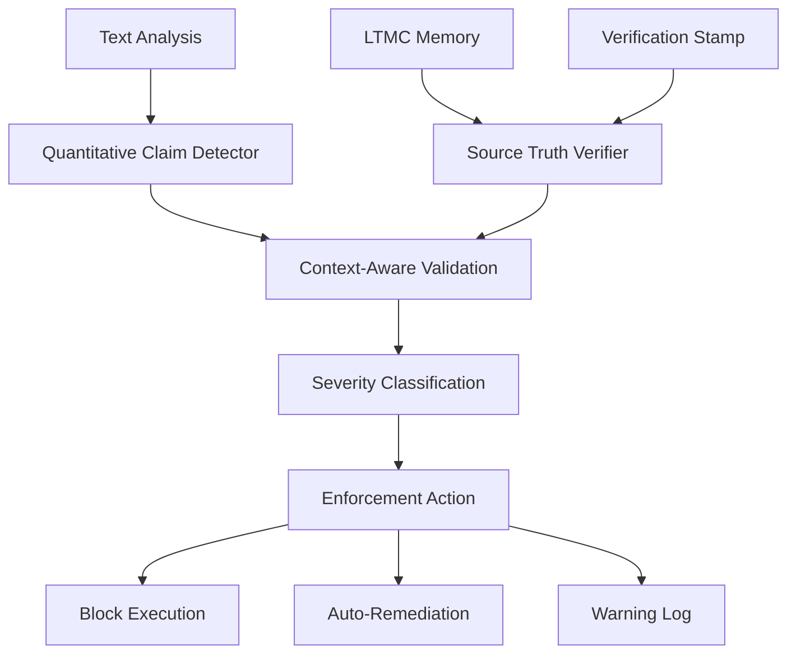
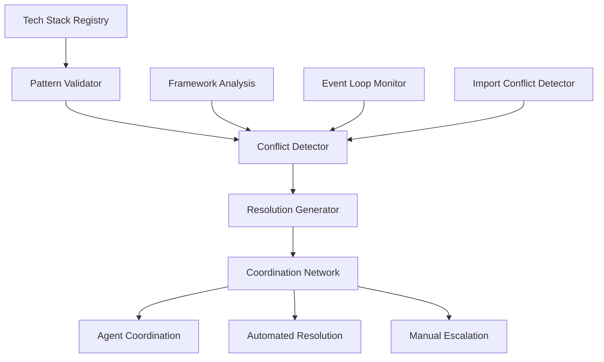
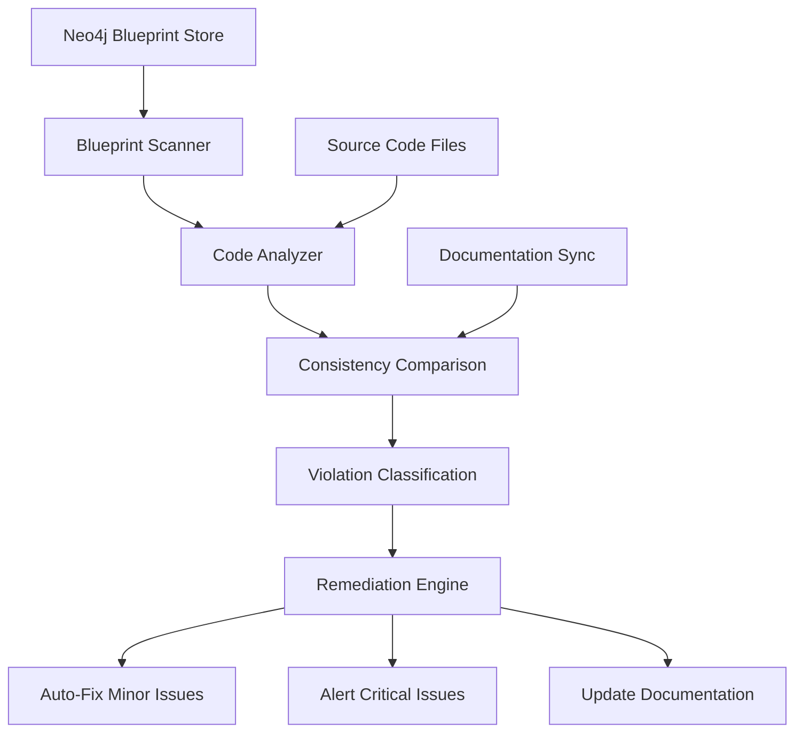
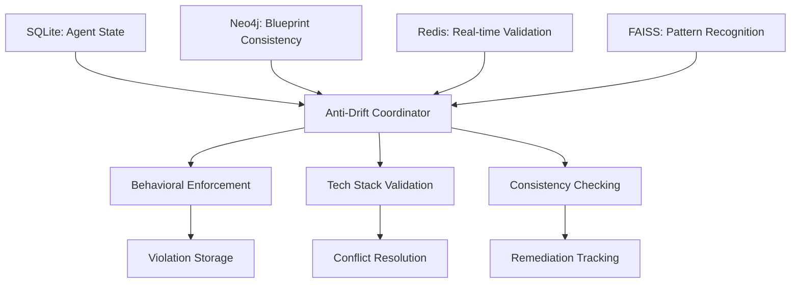

# LTMC Anti-Tech Stack Drift Architecture

## System Overview

LTMC implements a comprehensive **anti-tech stack drift architecture** that prevents AI agents from introducing inconsistencies, conflicts, or behavioral violations into development workflows. This system ensures technical consistency, prevents framework conflicts, and maintains behavioral compliance across all agent operations.

## Architecture Components

### 1. **Behavioral Enforcement Layer**
**Purpose**: Prevents false claims and behavioral drift through mandatory verification



**Components**:
- `BehavioralEnforcementEngine` - Main enforcement orchestrator
- `QuantitativeClaimDetector` - Detects numerical claims requiring verification
- `SourceTruthVerificationEngine` - Multi-method source code verification
- `BehavioralViolation` - Violation record and tracking system

### 2. **Tech Stack Alignment Layer**
**Purpose**: Maintains technical consistency across multiple agents



**Components**:
- `TechStackAlignmentAgent` - Multi-agent coordination orchestrator
- `StackRegistry` - Canonical tech stack definitions
- `ConflictDetector` - Framework and event loop conflict analysis
- `ResolutionGenerator` - Automated conflict resolution

### 3. **Consistency Validation Layer**  
**Purpose**: Ensures blueprint-code alignment and prevents architectural drift



**Components**:
- `ConsistencyValidationEngine` - Blueprint-code consistency validation
- `ViolationDetector` - Intelligent violation detection system
- `AutoRemediationEngine` - Smart automated fixes
- `ValidationMetrics` - Performance and compliance tracking

## Core Anti-Drift Mechanisms

### 1. **Quantitative Claim Verification**

```python
class QuantitativeClaimDetector:
    """
    Detects and validates quantitative claims about codebase.
    
    Monitored Patterns:
    - Tool counts: "LTMC has 30 tools" → Verify against source
    - Function counts: "126 functions" → AST analysis validation  
    - File counts: "50 files" → Directory scanning verification
    - Decorator counts: "126+ @mcp.tool" → Pattern matching validation
    """
    
    QUANTITATIVE_PATTERNS = [
        r'\b(\d+)\s+tools?\b',           # "30 tools", "11 tools"
        r'\b(\d+)\s+functions?\b',       # "126 functions"  
        r'\b(\d+)\s+files?\b',           # "50 files"
        r'\b(\d+)\s+lines?\b',           # "300 lines"
        r'\b(\d+)\s+classes?\b',         # "15 classes"
        r'\bhas\s+(\d+)\b',             # "has 30"
        r'\bcontains\s+(\d+)\b',        # "contains 126"
        r'\btotal\s+of\s+(\d+)\b',      # "total of 30"
        r'\b(\d+)\s+consolidated\b',     # "30 consolidated"
        r'\b(\d+)\+?\s+decorators?\b',   # "126+ decorators"
    ]
```

**Verification Process**:
1. **Pattern Detection**: RegEx analysis of agent output
2. **Multi-Method Verification**: grep + AST parsing + ripgrep
3. **Cryptographic Stamping**: Tamper-proof verification records
4. **Violation Classification**: CRITICAL/ERROR/WARNING/INFO levels
5. **Enforcement Action**: Block/remediate/log based on severity

### 2. **Tech Stack Conflict Resolution**

```python
class TechStackConflictResolver:
    """
    Resolves conflicts between different framework components.
    
    Conflict Types:
    - Framework Conflicts: FastAPI vs MCP protocol integration
    - Event Loop Conflicts: Multiple async frameworks
    - Import Conflicts: Duplicate or conflicting imports
    - Port Binding Conflicts: Multiple services on same port
    """
    
    async def detect_framework_conflicts(self, directory: Path) -> List[ValidationResult]:
        # Real file analysis - no mocks
        python_files = list(directory.rglob("*.py"))
        
        fastapi_files = []
        mcp_files = []
        
        for py_file in python_files:
            content = py_file.read_text()
            
            if self._has_fastapi_imports(content):
                fastapi_files.append(py_file)
            
            if self._has_mcp_imports(content):
                mcp_files.append(py_file)
        
        # Analyze conflicts and generate resolutions
        conflicts = self._analyze_framework_interactions(fastapi_files, mcp_files)
        return conflicts
```

### 3. **Event Loop Drift Prevention**

```python
class EventLoopMonitor:
    """
    Monitors and prevents event loop conflicts in async applications.
    
    Monitoring Capabilities:
    - Multiple event loop creation detection
    - Async/await pattern consistency
    - Thread-local event loop conflicts
    - Performance degradation from loop conflicts
    """
    
    async def detect_event_loop_conflicts(self, codebase_path: Path) -> List[EventLoopConflict]:
        conflicts = []
        
        # Analyze async patterns
        async_patterns = await self._analyze_async_patterns(codebase_path)
        
        # Detect multiple loop creation
        loop_creations = await self._detect_loop_creations(codebase_path)
        
        # Check for thread conflicts
        thread_conflicts = await self._analyze_thread_interactions(codebase_path)
        
        return conflicts
```

### 4. **Blueprint-Code Consistency Enforcement**

```python
class ConsistencyValidationEngine:
    """
    Enforces consistency between blueprints and implementation code.
    
    Validation Types:
    - Function signature consistency
    - Class hierarchy alignment
    - Module structure validation
    - Documentation synchronization
    - Type annotation consistency
    """
    
    async def validate_blueprint_consistency(self, blueprint_id: str, code_path: Path) -> ConsistencyReport:
        # Retrieve blueprint from Neo4j
        blueprint = await self.neo4j_store.get_blueprint(blueprint_id)
        
        # Analyze actual code structure
        code_structure = await self.code_analyzer.analyze_structure(code_path)
        
        # Compare and identify violations
        violations = await self._compare_structures(blueprint, code_structure)
        
        # Generate remediation plan
        remediation = await self._generate_remediation_plan(violations)
        
        return ConsistencyReport(
            blueprint_id=blueprint_id,
            violations=violations,
            remediation_plan=remediation,
            consistency_score=self._calculate_consistency_score(violations)
        )
```

## Multi-Agent Coordination Architecture

### Agent Communication Protocol

```python
class AgentCoordinationProtocol:
    """
    Coordinates anti-drift enforcement across multiple agents.
    
    Message Types:
    - TECH_STACK_VALIDATION_REQUEST: Request validation from other agents
    - VALIDATION_RESULT: Share validation results across agents  
    - CONFLICT_DETECTED: Alert other agents of conflicts
    - RESOLUTION_REQUEST: Request help resolving conflicts
    - COORDINATION_HANDOFF: Transfer coordination responsibility
    """
    
    async def coordinate_drift_prevention(self, agents: List[Agent], context: Dict) -> CoordinationResult:
        coordination_messages = []
        
        # Distribute validation tasks across agents
        for agent in agents:
            validation_request = AgentMessage(
                message_type=MessageType.TECH_STACK_VALIDATION_REQUEST,
                source_agent=self.agent_id,
                target_agent=agent.id,
                content={
                    "validation_scope": context["validation_scope"],
                    "tech_stack_requirements": context["requirements"],
                    "coordination_id": context["coordination_id"]
                }
            )
            
            coordination_messages.append(validation_request)
        
        # Collect and aggregate validation results
        validation_results = await self._collect_validation_results(coordination_messages)
        
        # Resolve conflicts through coordination
        if self._has_conflicts(validation_results):
            resolution = await self._coordinate_conflict_resolution(validation_results)
            return resolution
        
        return CoordinationResult(success=True, message="No conflicts detected")
```

### Cross-Agent Memory Synchronization

```python
class AntiDriftMemorySync:
    """
    Synchronizes anti-drift knowledge across agents.
    
    Synchronization Scopes:
    - Tech Stack Registry Updates
    - Conflict Resolution Patterns
    - Behavioral Violation History
    - Performance Optimization Rules
    """
    
    async def sync_anti_drift_knowledge(self, agents: List[Agent]) -> SyncResult:
        # Collect knowledge from all agents
        knowledge_updates = []
        
        for agent in agents:
            agent_knowledge = await self._extract_agent_knowledge(agent)
            knowledge_updates.append(agent_knowledge)
        
        # Merge and validate knowledge consistency
        merged_knowledge = await self._merge_knowledge(knowledge_updates)
        validated_knowledge = await self._validate_knowledge_consistency(merged_knowledge)
        
        # Distribute updated knowledge to all agents
        for agent in agents:
            await self._update_agent_knowledge(agent, validated_knowledge)
        
        return SyncResult(agents_updated=len(agents), knowledge_version=validated_knowledge.version)
```

## Performance and Monitoring Architecture

### Real-Time Metrics Collection

```python
class AntiDriftMetrics:
    """
    Comprehensive metrics for anti-drift system performance.
    
    Metric Categories:
    - Claim Verification Performance (ms per verification)
    - Conflict Detection Accuracy (false positive/negative rates)  
    - Resolution Success Rates (automated vs manual)
    - Agent Coordination Efficiency (message latency, throughput)
    - System Resource Utilization (CPU, memory impact)
    """
    
    async def collect_anti_drift_metrics(self) -> AntiDriftMetricsReport:
        metrics = {
            # Behavioral Enforcement Metrics
            "claims_analyzed_per_second": await self._measure_claim_analysis_rate(),
            "verification_accuracy_pct": await self._calculate_verification_accuracy(),
            "false_positive_rate": await self._calculate_false_positive_rate(),
            "enforcement_latency_ms": await self._measure_enforcement_latency(),
            
            # Tech Stack Validation Metrics  
            "conflicts_detected_per_hour": await self._count_conflicts_detected(),
            "auto_resolution_success_rate": await self._calculate_auto_resolution_rate(),
            "manual_intervention_required_pct": await self._calculate_manual_intervention_rate(),
            
            # Consistency Validation Metrics
            "blueprint_consistency_score": await self._calculate_consistency_score(),
            "drift_incidents_prevented": await self._count_drift_prevention(),
            "remediation_success_rate": await self._calculate_remediation_success(),
            
            # System Performance Metrics
            "anti_drift_overhead_pct": await self._measure_system_overhead(),
            "coordination_message_latency_ms": await self._measure_coordination_latency(),
            "agent_synchronization_time_ms": await self._measure_sync_time()
        }
        
        return AntiDriftMetricsReport(
            timestamp=datetime.now(),
            metrics=metrics,
            system_health=self._assess_system_health(metrics)
        )
```

### Alerting and Escalation

```python
class AntiDriftAlerting:
    """
    Intelligent alerting for critical drift violations.
    
    Alert Types:
    - CRITICAL: Immediate system compromise (false claims about security)
    - HIGH: Significant accuracy issues (multiple false claims)
    - MEDIUM: Tech stack inconsistencies (framework conflicts)
    - LOW: Minor drift indicators (documentation misalignment)
    """
    
    async def process_drift_alert(self, violation: BehavioralViolation) -> AlertAction:
        alert_config = {
            ViolationSeverity.CRITICAL: {
                "immediate_block": True,
                "escalate_to_human": True,
                "stop_all_agents": True,
                "notification_channels": ["slack", "email", "sms"]
            },
            ViolationSeverity.ERROR: {
                "block_specific_agent": True,
                "escalate_to_lead": True,
                "notification_channels": ["slack", "email"]
            },
            ViolationSeverity.WARNING: {
                "log_and_continue": True,
                "notification_channels": ["slack"]
            }
        }
        
        config = alert_config[violation.severity]
        return await self._execute_alert_action(violation, config)
```

## Integration Points

### Database Integration



#### SQLite Integration
- **Agent state persistence** across enforcement sessions
- **Violation history** and trend analysis
- **Configuration management** and rule updates
- **Performance metrics** and audit logs

#### Neo4j Integration  
- **Blueprint-code relationships** for consistency validation
- **Tech stack dependency** mapping and conflict analysis
- **Agent coordination** graph for communication patterns
- **Resolution pattern** storage and reuse

#### Redis Integration
- **Real-time validation** caching for performance
- **Agent coordination** messaging and state synchronization
- **Conflict detection** results and resolution status
- **Performance metrics** for live monitoring

#### FAISS Integration
- **Pattern recognition** for violation detection
- **Similar violation** matching for resolution suggestions
- **Agent behavior** analysis for drift prediction
- **Knowledge base** search for resolution patterns

### External System Integration

#### CI/CD Pipeline Integration
```python
async def integrate_with_cicd_pipeline():
    """
    Integrate anti-drift system with CI/CD pipeline.
    
    Integration Points:
    - Pre-commit hooks for drift prevention
    - Build-time validation and enforcement
    - Deployment-time consistency checks
    - Post-deployment drift monitoring
    """
    
    # Pre-commit validation
    pre_commit_config = {
        "behavioral_enforcement": True,
        "tech_stack_validation": True,
        "consistency_checking": True,
        "block_on_violations": ["CRITICAL", "ERROR"]
    }
    
    # Build-time integration
    build_integration = {
        "validate_dependencies": True,
        "check_framework_conflicts": True,
        "verify_documentation_sync": True,
        "performance_regression_check": True
    }
    
    return {
        "pre_commit": pre_commit_config,
        "build_time": build_integration
    }
```

## Scalability Architecture

### Horizontal Scaling Design

```python
class AntiDriftScaling:
    """
    Horizontal scaling for anti-drift system.
    
    Scaling Capabilities:
    - Distributed validation processing
    - Load-balanced agent coordination
    - Sharded violation storage
    - Replicated pattern recognition
    """
    
    async def scale_anti_drift_system(self, load_metrics: Dict) -> ScalingAction:
        current_capacity = await self._assess_current_capacity()
        required_capacity = await self._calculate_required_capacity(load_metrics)
        
        if required_capacity > current_capacity * 0.8:
            # Scale up validation nodes
            new_nodes = await self._provision_validation_nodes(
                count=self._calculate_node_requirement(required_capacity)
            )
            
            # Distribute validation workload
            await self._redistribute_validation_load(new_nodes)
            
            # Update coordination network
            await self._update_coordination_topology(new_nodes)
        
        return ScalingAction(
            action="scale_up" if required_capacity > current_capacity else "maintain",
            nodes_added=len(new_nodes) if required_capacity > current_capacity else 0
        )
```

## Security and Compliance

### Security Architecture

```python
class AntiDriftSecurity:
    """
    Security framework for anti-drift system.
    
    Security Features:
    - Tamper-proof verification stamps
    - Encrypted agent communication
    - Access control for enforcement rules
    - Audit trail for all enforcement actions
    """
    
    async def secure_anti_drift_operations(self):
        # Cryptographic verification stamps
        verification_stamp = await self._generate_verification_stamp(claim, verification_result)
        
        # Secure agent communication
        encrypted_message = await self._encrypt_agent_message(coordination_message)
        
        # Access control validation
        authorized = await self._validate_enforcement_permissions(agent, enforcement_action)
        
        # Comprehensive audit logging
        await self._log_enforcement_action(agent, action, result, timestamp)
```

## Future Enhancements

### Planned Architecture Improvements

1. **Machine Learning Integration**
   - Predictive drift detection using historical patterns
   - Automated resolution suggestion based on success rates
   - Anomaly detection for unusual agent behaviors

2. **Advanced Pattern Recognition**
   - Deep learning models for complex violation detection
   - Natural language processing for context-aware validation
   - Multi-modal analysis combining code, documentation, and behavior

3. **Self-Healing Architecture**
   - Automatic system recovery from drift incidents
   - Dynamic rule adaptation based on effectiveness
   - Autonomous conflict resolution without human intervention

4. **Global Distribution**
   - Multi-region anti-drift coordination
   - Distributed consensus for enforcement decisions
   - Edge-based validation for reduced latency

---

*This architecture provides the technical foundation for LTMC's comprehensive anti-tech stack drift system, ensuring AI agents maintain technical consistency and behavioral compliance across all development workflows.*