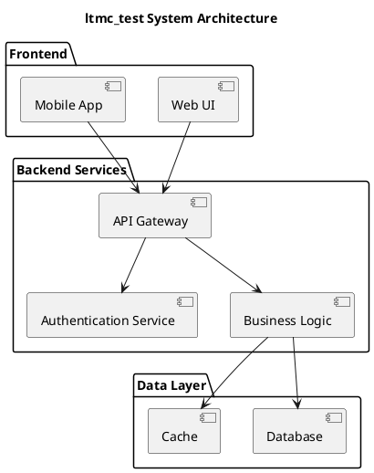

# ltmc_test System Architecture

Generated on: 2025-08-22 17:01:47

## Diagram

## Description

This system architecture diagram shows the main components and their relationships. Dependencies and data flows are included.