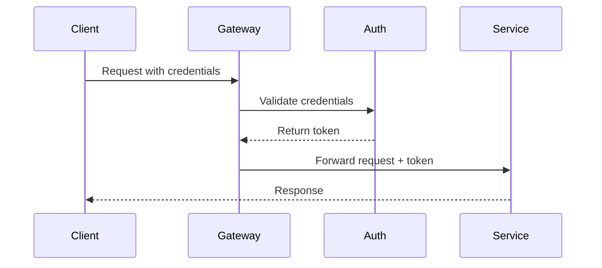

# System Architecture Documentation

**Project:** {project_id}  
**Generated:** {generated_at}  
**Blueprint ID:** {blueprint_id}  
**Template:** Standard Architecture Documentation Format

---

## Architecture Overview

{architecture_overview}

This document provides a comprehensive view of the system architecture, including component relationships, dependencies, and data flows.

### Architecture Metrics
- **Components:** {component_count}
- **Dependencies:** {dependency_count}
- **Diagram Type:** {diagram_type}

---

## System Architecture Diagram

```mermaid
{diagram_content}
```

---

## Component Descriptions

### Core Components

{components_section}

### Service Dependencies

{dependencies_section}

---

## Data Flow Architecture

### Request Processing Flow
1. **Client Request** → API Gateway
2. **Authentication** → Security Service
3. **Routing** → Application Services
4. **Business Logic** → Domain Services
5. **Data Access** → Database Layer
6. **Response** → Client

### Data Storage Architecture
- **Primary Database:** PostgreSQL for transactional data
- **Cache Layer:** Redis for session and temporary data
- **Search Index:** Elasticsearch for full-text search
- **File Storage:** S3-compatible storage for assets

---

## Security Architecture

### Security Layers
1. **Network Security:** HTTPS, VPN, Firewall rules
2. **Application Security:** Authentication, authorization, input validation
3. **Data Security:** Encryption at rest and in transit
4. **Monitoring:** Logging, alerting, audit trails

### Authentication Flow


---

## Scalability and Performance

### Horizontal Scaling
- **Load Balancing:** Multiple application instances
- **Database Sharding:** Distributed data storage
- **Caching Strategy:** Multi-layer cache architecture
- **CDN Integration:** Static asset distribution

### Performance Targets
- **API Response Time:** < 200ms (95th percentile)
- **Database Query Time:** < 50ms (95th percentile)
- **Cache Hit Rate:** > 90%
- **Uptime:** 99.9% availability

---

## Deployment Architecture

### Environment Tiers
- **Development:** Local development environment
- **Staging:** Pre-production testing environment
- **Production:** Live system environment

### Deployment Strategy
- **Blue-Green Deployment:** Zero-downtime deployments
- **Feature Flags:** Gradual feature rollout
- **Health Checks:** Continuous service monitoring
- **Rollback Capability:** Quick recovery from issues

---

## Monitoring and Observability

### Monitoring Stack
- **Metrics:** Prometheus + Grafana
- **Logging:** ELK Stack (Elasticsearch, Logstash, Kibana)
- **Tracing:** Jaeger for distributed tracing
- **Alerting:** PagerDuty for incident management

### Key Metrics
- **System Health:** CPU, Memory, Disk usage
- **Application Metrics:** Request rate, error rate, response time
- **Business Metrics:** User activity, feature usage
- **Security Metrics:** Failed logins, suspicious activity

---

## Disaster Recovery

### Backup Strategy
- **Database Backups:** Automated daily backups with point-in-time recovery
- **File Backups:** Continuous replication to backup storage
- **Configuration Backups:** Version-controlled infrastructure as code

### Recovery Procedures
- **RTO (Recovery Time Objective):** 4 hours
- **RPO (Recovery Point Objective):** 15 minutes
- **Failover Process:** Automated failover to secondary region
- **Data Restoration:** Automated backup restoration procedures

---

## Technology Stack

### Backend Technologies
- **Runtime:** Python 3.11+ with FastAPI framework
- **Database:** PostgreSQL 14+ for primary data
- **Cache:** Redis 6+ for session and temporary data
- **Message Queue:** RabbitMQ for asynchronous processing

### Frontend Technologies
- **Framework:** React 18+ with TypeScript
- **State Management:** Redux Toolkit
- **UI Library:** Material-UI or Tailwind CSS
- **Build Tools:** Vite with esbuild

### Infrastructure
- **Container Platform:** Docker with Kubernetes orchestration
- **Cloud Provider:** AWS/GCP/Azure
- **CI/CD:** GitHub Actions or GitLab CI
- **Service Mesh:** Istio for microservices communication

---

## API Architecture

### RESTful Design
- **Resource-based URLs:** `/api/v1/resources/{id}`
- **HTTP Methods:** GET, POST, PUT, DELETE for CRUD operations
- **Status Codes:** Standard HTTP response codes
- **Content Negotiation:** JSON primary, XML optional

### API Versioning
- **URL Versioning:** `/api/v1/`, `/api/v2/`
- **Backward Compatibility:** Maintain previous versions
- **Deprecation Policy:** 12-month deprecation notice
- **Migration Guides:** Comprehensive upgrade documentation

---

## Configuration Management

### Environment Configuration
- **Environment Variables:** For deployment-specific settings
- **Configuration Files:** For application-specific settings
- **Secret Management:** Encrypted storage of sensitive data
- **Feature Flags:** Runtime behavior configuration

### Configuration Sources
1. **Default Values:** Built-in application defaults
2. **Configuration Files:** YAML/JSON configuration files
3. **Environment Variables:** Runtime environment settings
4. **Remote Configuration:** Centralized configuration service

---

*Architecture documentation generated automatically on {generated_at}*